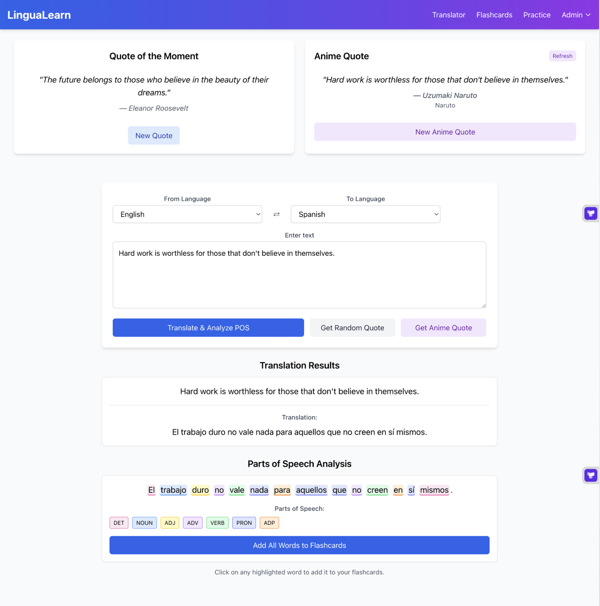

# 🌍 LinguaLearn – Language Learning Application

A full-featured, modern web application for mastering new languages using advanced NLP, AI-powered translation, and interactive learning tools.

---

## 🚀 Features

- 🔤 **Text Translation**: Seamlessly translate text across multiple languages using Lecto AI API.
- 🧠 **Part-of-Speech Tagging (POS)**: NLP-powered grammatical analysis using spaCy.
- 🃏 **Interactive Flashcards**: Generate vocabulary flashcards from translations.
- ⏳ **Spaced Repetition System**: Practice flashcards based on proven memory science.
- 💬 **Inspirational Quotes**: Get motivational content via ZenQuotes API to translate and study.
- 🌐 **Multi-language Support**: English, Spanish, French, German, Chinese, and more.

---



## 🧠 NLP & AI Techniques Used

### ✅ spaCy-based POS Tagging
We use [spaCy](https://spacy.io/) for:
- Tokenization
- Language-specific POS tagging
- Universal POS tag mapping across languages

Supported spaCy models:
- `en_core_web_sm` (English)
- `fr_core_news_sm` (French)
- `es_core_news_sm` (Spanish)
- `de_core_news_sm` (German)

### 🌐 Lecto AI Translation
Lecto AI enables:
- Real-time, accurate translation
- Multi-language support (20+ languages)
- Text segmentation for flashcard building

### 🤖 Gemini AI (Fallback NLP)
When spaCy doesn't support a language, we use [Google Gemini AI](https://ai.google.dev/) to:
- Extract part-of-speech data using prompts
- Analyze sentence structure and syntax
- Ensure multilingual NLP coverage

---

## 🛠 Tech Stack

| Frontend         | Backend         | AI & NLP          | Styling        |
|------------------|------------------|--------------------|----------------|
| React + TypeScript | Flask (Python)    | spaCy, Gemini AI   | Tailwind CSS   |
| React Router     | Flask-CORS        | Lecto AI API       | CSS Modules    |
| LocalStorage     | REST APIs         | ZenQuotes API      | Responsive UI  |

---

## 🎓 What We Learned

### 🔍 POS Tagging Implementation
- Handling multiple NLP models dynamically
- Mapping various language tags to a standard POS schema
- Fallback mechanism using Gemini AI when spaCy is unavailable

### 🌐 Translation Pipeline
- Consuming Lecto AI API securely
- Managing async translation + NLP processes in the frontend
- Filtering out punctuation and whitespace from analysis

### 🧩 Flashcard + Spaced Repetition Design
- Creating dynamic flashcards from POS-tagged words
- Storing learning progress via `LocalStorage`
- Using intuitive animations and feedback cues

---

## 📁 Project Structure

language-learning-app/
├── public/ # Static assets
├── src/
│ ├── components/ # React UI components
│ ├── services/ # API handlers
│ ├── hooks/ # Custom React hooks
│ ├── utils/ # Helper functions
│ ├── types/ # TypeScript types
│ ├── App.tsx # Main app
│ └── index.tsx # React entry point
├── backend/
│ ├── app.py # Flask backend
│ ├── setup.py # Setup script
│ ├── requirements.txt # Python dependencies
└── README.md

yaml
Copy
Edit

---

## 🔧 Getting Started

### ✅ Prerequisites

- Node.js (v14+)
- Python 3.8+
- Lecto AI API Key (free tier works)
- Google Gemini AI API Key (optional for fallback)

---

### ⚙️ Installation

#### 1. Clone the repository
```bash
git clone <repository-url>
cd language-learning-app
```
#### 2. Install frontend dependencies

npm install

#### 3. Create .env in the root directory:
env
REACT_APP_LECTO_API_KEY=your_lecto_api_key_here
REACT_APP_GEMINI_API_KEY=your_gemini_api_key_here
REACT_APP_BACKEND_URL=http://localhost:5000/api
4. Set up the Python backend:
bash
Copy
Edit
cd backend
python setup.py
source venv/bin/activate  # Windows: venv\Scripts\activate
python app.py
5. Start frontend:
bash
Copy
Edit
cd ..
npm start
🧪 Usage
Input text in your native language.

Choose a target language.

Click "Translate & Analyze POS".

See words highlighted by part of speech.

Click a word to add it to your flashcard deck.

Visit "Practice" to review and test vocabulary.

📖 Documentation & References
spaCy Documentation

Lecto AI API Docs

ZenQuotes API

Google Generative AI

React Documentation

Flask Docs

Tailwind CSS Docs

📜 License
This project is licensed under the MIT License.

🙏 Acknowledgments
Developers and linguists behind spaCy and open NLP tools

Lecto AI and Google for accessible APIs

The language learning community for feedback and feature ideas

yaml
Copy
Edit

---

Let me know if you'd like a PDF version of this README or a GitHub-ready `README.md` file download.
